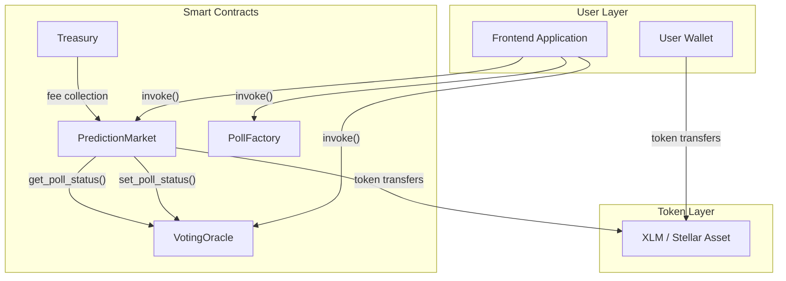
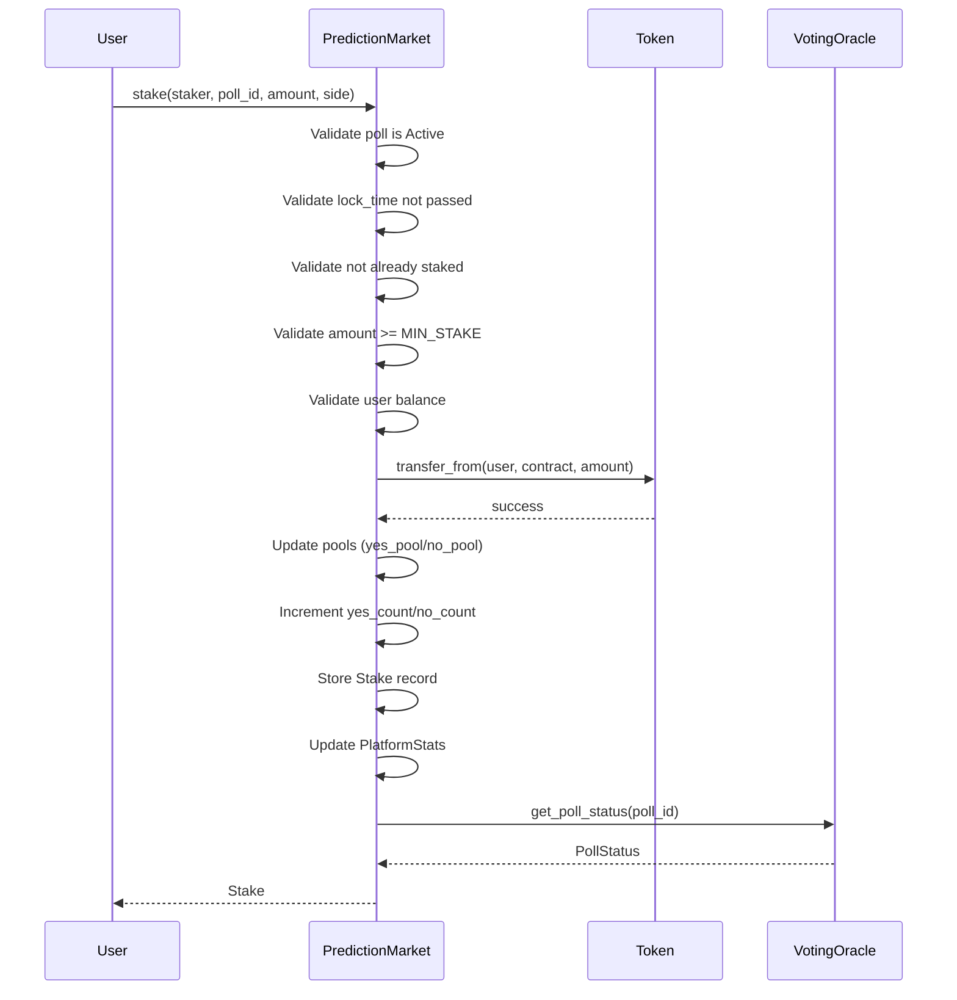
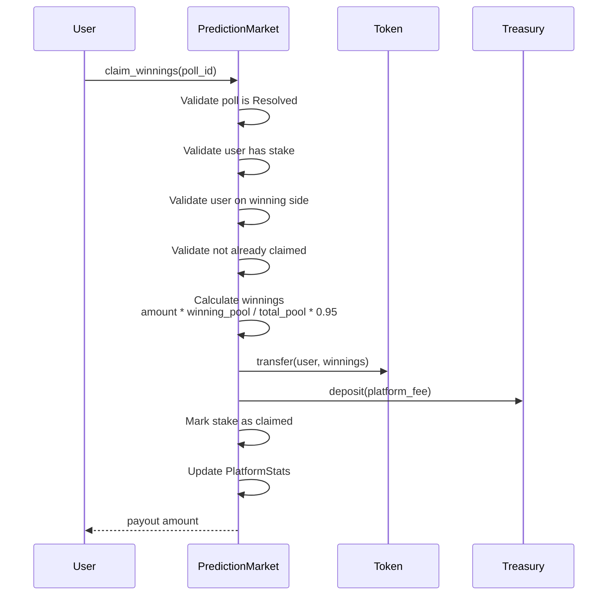
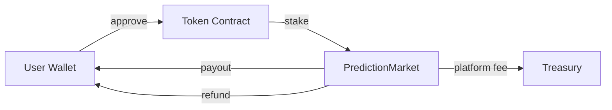
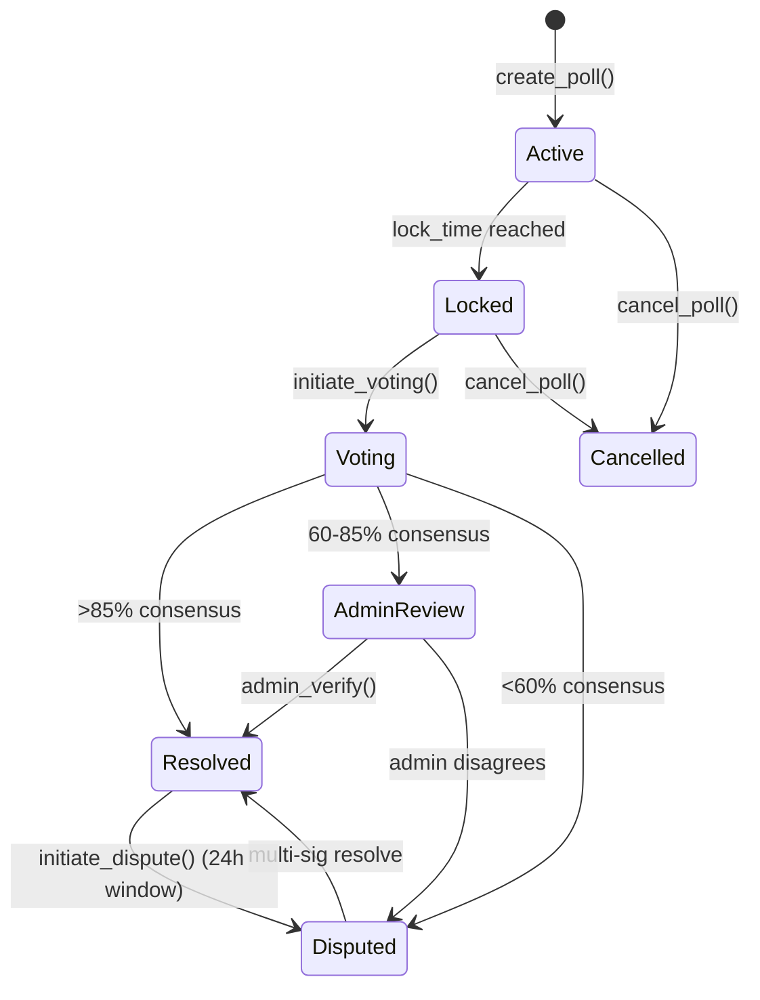

# PredictX Architecture

## Overview

PredictX is a decentralized football prediction market built on the **Stellar blockchain** using the **Soroban SDK**. Users stake cryptocurrency on specific football match events, and winners split the pool proportionally after community-verified resolution.

## System Architecture



## Contract Responsibilities

### PredictionMarket

The core contract managing polls, stakes, and payouts.

| Responsibility | Description |
|----------------|-------------|
| Poll Management | Create, retrieve, and manage prediction polls |
| Staking | Accept stakes, track pool amounts, prevent double-staking |
| Match Management | Create and update football matches |
| Emergency Withdrawal | Allow refunds after timeouts or cancellations |
| Token Management | Handle token approvals and transfers |

**Storage Keys:**
- `Admin` - Contract administrator address
- `VotingOracle` - Oracle contract address
- `TokenAddress` - Staking token contract
- `TreasuryAddress` - Fee collection address
- `Poll(u64)` - Individual poll data
- `Stake(u64, Address)` - User stake records
- `Match(u64)` - Match data
- `PlatformStats` - Aggregate platform statistics

### VotingOracle

Manages poll status transitions and community voting for outcome resolution.

| Responsibility | Description |
|----------------|-------------|
| Status Tracking | Track poll lifecycle status per poll |
| Status Updates | Allow admin to transition poll status |
| Timestamp Tracking | Record when status was last updated |

**Note:** Full voting mechanics (community voting, consensus thresholds) are planned for Phase 2.

### Treasury

Holds platform fees and manages fund distribution.

| Responsibility | Description |
|----------------|-------------|
| Balance Tracking | Track per-user balances |
| Deposit Handling | Accept deposits from users |
| Fee Collection | Receive platform fees from PredictionMarket |

**Note:** Real token integration (actual transfers) is planned for Phase 2.

### PollFactory

Factory contract for modular poll creation and discovery.

| Responsibility | Description |
|----------------|-------------|
| Poll Creation | Create polls with creator authentication |
| Poll Storage | Store polls persistently |
| Poll Retrieval | Fetch poll by ID |

**Note:** This is a Phase 1 scaffolding contract. The PredictionMarket has primary poll creation logic.

## Data Flow: Stake on a Poll



## Data Flow: Claim Winnings



## Storage Design

### Persistent vs Instance Storage

| Storage Type | Usage | Example Keys |
|--------------|-------|--------------|
| **Instance** | Contract configuration, counters | `Admin`, `TokenAddress`, `NextPollId` |
| **Persistent** | User-facing data, long-lived | `Poll(u64)`, `Stake(u64, Address)`, `Match(u64)` |

**Rationale:** Soroban differentiates between instance storage (contract-wide config) and persistent storage (data that persists across invocations). Instance storage is more gas-efficient for frequently-accessed config data.

### DataKey Pattern

All contracts use a `DataKey` enum to namespace storage:

```rust
enum DataKey {
    Admin,
    TokenAddress,
    Poll(u64),
    Stake(u64, Address),
    // ...
}
```

This prevents key collisions between different data types.

## Cross-Contract Interactions

### PredictionMarket → VotingOracle

```rust
// PredictionMarket calls VotingOracle to check/update poll status
let client = voting_oracle::Client::new(&env, &oracle_id);
client.set_poll_status(&poll_id, &status);
let current_status = client.get_poll_status(&poll_id);
```

### Dependency Pattern

PredictionMarket depends on VotingOracle for:
- Poll status queries (`get_poll_status`)
- Status update triggers (`set_poll_status`)

VotingOracle is a standalone contract that:
- Tracks status per poll ID
- Records timestamp of last update
- Allows admin-only status modifications

## Token Flow



**Flows:**
1. **Stake:** User → PredictionMarket (via `transfer_from`)
2. **Payout:** PredictionMarket → User (winners get proportional share minus 5% fee)
3. **Refund:** PredictionMarket → User (emergency withdrawal)
4. **Fee:** PredictionMarket → Treasury (5% platform fee)

## Poll Lifecycle



## Security Model

### Access Control

| Role | Capabilities |
|------|-------------|
| **Admin** | Initialize contracts, pause/unpause, cancel polls, update oracle |
| **User** | Stake, create polls, vote, claim winnings |
| **Oracle** | Update poll status (called by PredictionMarket on admin action) |

### Key Protections

1. **Double-Stake Prevention** - Users can only stake once per poll
2. **Lock Time Enforcement** - No stakes after lock time
3. **Emergency Timeout** - 7-day grace period before emergency withdrawal on disputed/locked polls
4. **Pause Mechanism** - Admin can halt contract in emergencies

## Constants

| Constant | Value | Description |
|----------|-------|-------------|
| `PLATFORM_FEE_BPS` | 500 | 5% platform fee |
| `VOTING_WINDOW_SECS` | 7,200 | 2-hour voting window |
| `DISPUTE_WINDOW_SECS` | 86,400 | 24-hour dispute window |
| `AUTO_RESOLVE_THRESHOLD_BPS` | 8,500 | 85% consensus for auto-resolve |
| `ADMIN_REVIEW_THRESHOLD_BPS` | 6,000 | 60% consensus for admin review |
| `MULTI_SIG_REQUIRED` | 3 | Admin signatures for multi-sig |
| `MAX_POLLS_PER_MATCH` | 50 | Maximum polls per match |
| `MIN_STAKE_AMOUNT` | 10,000,000 | Minimum stake (7 decimals) |
| `EMERGENCY_TIMEOUT_SECS` | 604,800 | 7 days before emergency withdrawal |

## Error Handling

All contracts share error codes from `predictx_shared::PredictXError`:

| Code | Error | Description |
|------|-------|-------------|
| 1 | `NotInitialized` | Contract not initialized |
| 2 | `AlreadyInitialized` | Contract already initialized |
| 3 | `Unauthorized` | Caller is not admin |
| 4 | `PollNotFound` | Poll does not exist |
| 5 | `PollNotActive` | Poll is not active |
| 6 | `PollLocked` | Poll is locked |
| 11 | `AlreadyStaked` | User already staked |
| 34 | `StakeBelowMinimum` | Stake below minimum |

See [`predictx_shared::errors`](https://github.com/samieazubike/predictx-contract/blob/main/packages/shared/src/errors.rs) for full list.
