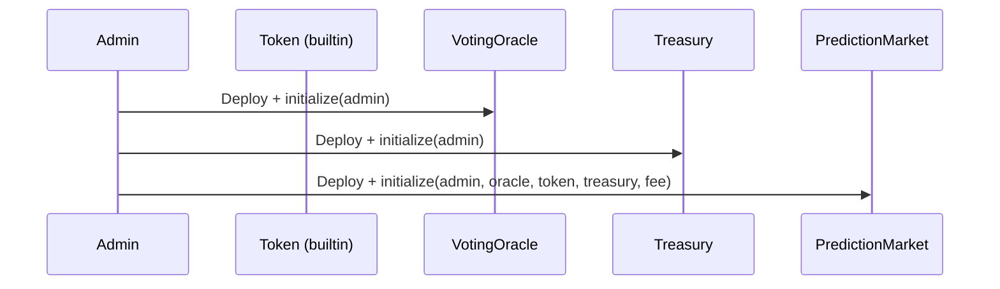

# Deployment Guide

Procedures for deploying PredictX contracts to Stellar testnet and mainnet.

## Deployment Order

Contracts must be deployed in this specific order:



**Why this order?**
1. `VotingOracle` is deployed first — `PredictionMarket` references it
2. `Treasury` is deployed second — `PredictionMarket` references it
3. `PredictionMarket` is deployed last — it requires oracle and treasury addresses

---

## Prerequisites

1. Stellar account with sufficient XLM balance for deployment
2. Stellar CLI installed and configured
3. WASM binaries built

```bash
# Build all WASM binaries
cargo build --target wasm32-unknown-unknown --release
```

---

## Deploy Scripts

Use the provided deploy script:

```bash
./scripts/deploy.sh testnet
```

Or deploy manually step by step:

### Step 1: Deploy VotingOracle

```bash
ORACLE_ID=$(stellar contract deploy \
    --source $SOURCE_ACCOUNT \
    --network testnet \
    --wasm target/wasm32-unknown-unknown/release/voting_oracle.wasm)

echo "Oracle ID: $ORACLE_ID"
```

Initialize:
```bash
stellar contract invoke \
    --id $ORACLE_ID \
    --source $SOURCE_ACCOUNT \
    --network testnet \
    -- \
    initialize \
    --admin $ADMIN_PUBLIC_KEY
```

### Step 2: Deploy Treasury

```bash
TREASURY_ID=$(stellar contract deploy \
    --source $SOURCE_ACCOUNT \
    --network testnet \
    --wasm target/wasm32-unknown-unknown/release/treasury.wasm)

echo "Treasury ID: $TREASURY_ID"
```

Initialize:
```bash
stellar contract invoke \
    --id $TREASURY_ID \
    --source $SOURCE_ACCOUNT \
    --network testnet \
    -- \
    initialize \
    --admin $ADMIN_PUBLIC_KEY
```

### Step 3: Deploy Token

For testnet, use the built-in Stellar Asset Contract:

```bash
# Create a Stellar Asset (or use existing)
stellar contract asset deploy \
    --source $SOURCE_ACCOUNT \
    --network testnet \
    --asset USDC:GCZNF24HPMYTV6NOEHI7Q5RJFFUI23JKUKY3H3XTQAFBQIBOHG5EYPP
```

### Step 4: Deploy PredictionMarket

```bash
PM_ID=$(stellar contract deploy \
    --source $SOURCE_ACCOUNT \
    --network testnet \
    --wasm target/wasm32-unknown-unknown/release/prediction_market.wasm)

echo "PredictionMarket ID: $PM_ID"
```

Initialize:
```bash
stellar contract invoke \
    --id $PM_ID \
    --source $SOURCE_ACCOUNT \
    --network testnet \
    -- \
    initialize \
    --admin $ADMIN_PUBLIC_KEY \
    --voting_oracle $ORACLE_ID \
    --token_address $TOKEN_ID \
    --treasury_address $TREASURY_ID \
    --platform_fee_bps 500
```

---

## Configuration

### Environment Variables

```bash
export SOURCE_ACCOUNT="GDQEO2HGZCH7TSHB7JWT6UWUMSWGAHFFG4VTC6YMGJLb3JB3TJJHGWA"
export NETWORK="testnet"
export ORACLE_ID="CDLZFC3SYJYDZT7K67VZ75HPJVIEUVNIXF47ZG2FB2RMQQVU2HHGCYSC"
export TREASURY_ID="GACKON5CEN5XUJ4EJKLLTOUD5S5CW3F3GGZYDHE7Y447QHLQTY4HLLT"
export PM_ID="GAHXMKOM2QT3J5CSL4OB5C6FG6OR27TMIYMMTGW45KM7TY7H7DQKGYI"
```

### Platform Fee

The platform fee is set during initialization:

| Fee BPS | Percentage |
|---------|------------|
| 500 | 5% |
| 300 | 3% |
| 100 | 1% |

**Warning:** Fee cannot be changed after initialization. Plan accordingly for mainnet.

---

## Verification

### Verify Deployment

```bash
# Check admin is set
stellar contract invoke \
    --id $PM_ID \
    --source $SOURCE_ACCOUNT \
    --network testnet \
    -- \
    admin

# Check oracle is set
stellar contract invoke \
    --id $PM_ID \
    --source $SOURCE_ACCOUNT \
    --network testnet \
    -- \
    oracle

# Check token is set
stellar contract invoke \
    --id $PM_ID \
    --source $SOURCE_ACCOUNT \
    --network testnet \
    -- \
    get_token_address

# Check treasury is set
stellar contract invoke \
    --id $PM_ID \
    --source $SOURCE_ACCOUNT \
    --network testnet \
    -- \
    get_treasury_address
```

### Verify Platform Stats

```bash
stellar contract invoke \
    --id $PM_ID \
    --source $SOURCE_ACCOUNT \
    --network testnet \
    -- \
    get_platform_stats
```

---

## Mainnet Deployment

Mainnet deployment follows the same steps with these differences:

### 1. Security Review

- Complete smart contract audit
- Run fuzzing tests
- Verify all dependencies
- Review access control

### 2. Mainnet Network

```bash
export NETWORK="mainnet"
export SOURCE_ACCOUNT="your-mainnet-account"
```

### 3. Asset

Use a reputable Stellar asset (e.g., USDC on Stellar) rather than creating a new one.

### 4. Fee Configuration

Set appropriate platform fee for mainnet sustainability.

---

## Contract Upgrades

**Current Phase:** Phase 1 — Contract upgrades not yet implemented.

**Planned upgrade path:**
- Use Soroban upgrade capability
- Timelock upgrades (24-48 hour delay)
- Multi-sig governance

---

## Troubleshooting

### "Contract not found"

Ensure the contract ID is correct and the network matches.

```bash
stellar contract info --id $PM_ID --network testnet
```

### "Already initialized"

The contract was already initialized. You cannot re-initialize. Deploy a new instance.

### "Insufficient balance"

Ensure your account has enough XLM for deployment and storage.

---

## Post-Deployment Checklist

- [ ] All contracts initialized
- [ ] Admin keys secured
- [ ] Contract IDs documented
- [ ] Initial match created
- [ ] Test stake placed
- [ ] Test withdrawal verified
